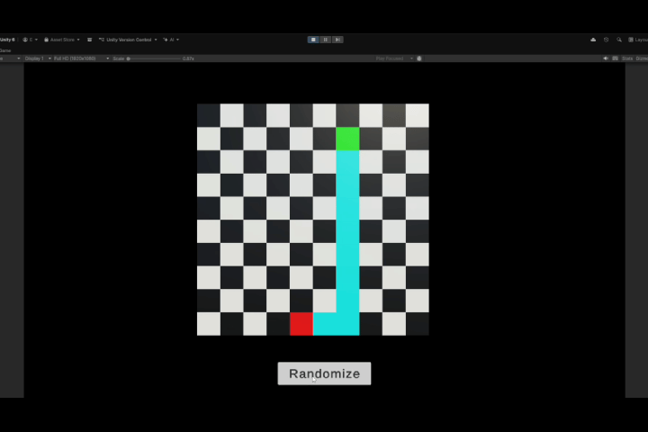

🧩 GridManager — A* Pathfinding Visualizer for Unity

GridManager creates a clean, chessboard-style grid where A* finds its way from a random green start tile 🟩 to a red goal tile 🟥 — and shows the path in cyan 💡.

  

✨ Features

✅ Automatically generates a grid of tiles (custom size & spacing)
🎯 Random Start and End points each run
🚀 Press Button to randomize again instantly
🧠 Built-in A* algorithm with visualized path
🎨 Path tiles turn cyan, keeping start/end highlighted
💡 Clean, dependency-free, and works in any Unity version

🧱 Requirements

⚙️ Unity — works with all versions
🔤 TextMeshPro — optional

🕹️ How to Use

Import the .unitypackage into your Unity project.

Open Demo Scene and look around of GridManager

Assign a Tile Prefab (any simple cube or quad works!).

Hit Play ▶️ — watch A* find its way!

Press Button to randomize start/end tiles and recalculate the path.

